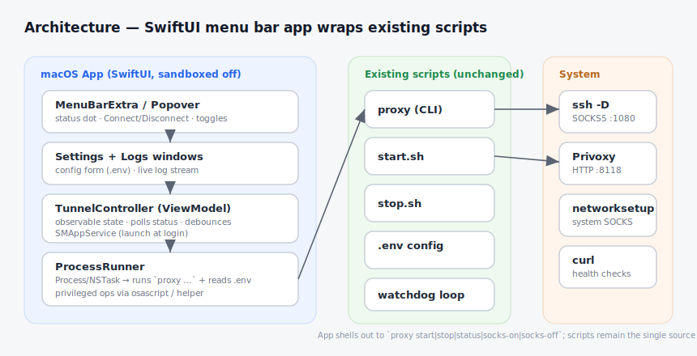
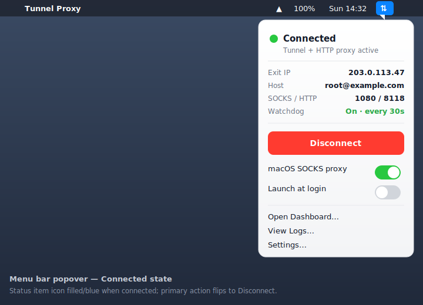
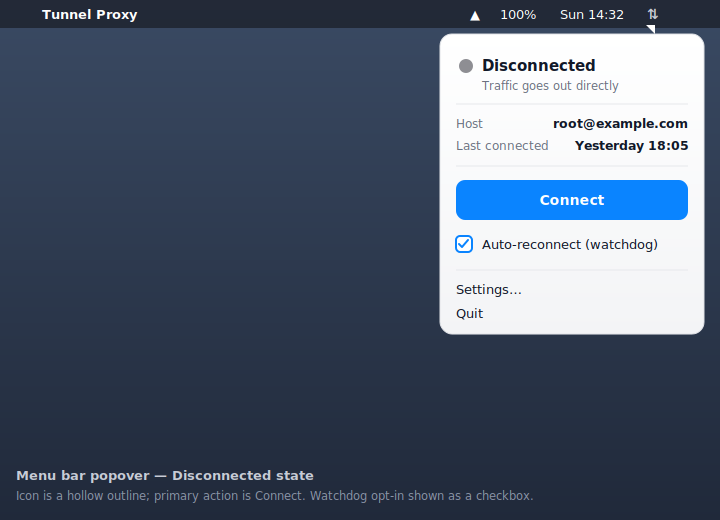
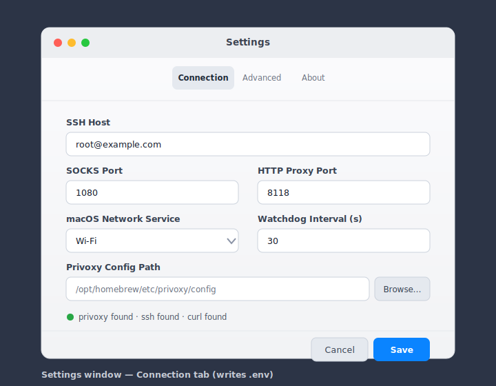
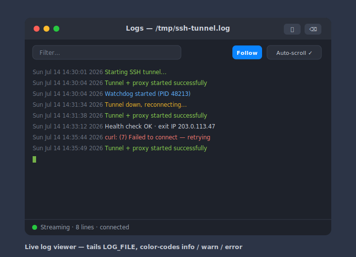

# Plan: Tunnel Proxy — macOS GUI App

A native macOS menu bar app that wraps the existing `proxy` / `start.sh` / `stop.sh`
scripts, giving a point-and-click front end to the SSH SOCKS5 → Privoxy HTTP proxy
pipeline. The scripts stay the single source of truth; the app is a thin,
observable UI on top of them.

## Decisions (confirmed)

| Question | Choice |
|----------|--------|
| Tech stack | **Native SwiftUI menu bar app** (`MenuBarExtra`) |
| Tunnel logic | **Shell out to existing scripts** — no reimplementation |
| Scope | Config editor · Live log viewer · Status + exit IP · Launch at login + auto-start |

## Goals

- One-click **Connect / Disconnect** from the menu bar.
- At-a-glance **status**: connected / disconnected / reconnecting, plus current exit IP.
- Toggle **macOS SOCKS proxy** and **watchdog auto-reconnect** without the terminal.
- Edit `.env` through a **form** with validation and a dependency check.
- **Live log** streaming with filter, follow, and clear.
- **Launch at login** and optional **auto-connect on launch**.

## Non-goals

- Reimplementing SSH/Privoxy logic in Swift (we shell out).
- Managing SSH keys / `~/.ssh/config` (assumed pre-configured, as today).
- Windows/Linux builds (menu bar UX is macOS-specific).
- App Store distribution in v1 (sandbox conflicts with `networksetup`/`Process`; ship notarized DMG instead).

## Architecture



```
SwiftUI App
  MenuBarExtra (popover)  ──┐
  Settings window          ├─► TunnelController (ObservableObject)
  Logs window            ──┘        │
                                    ├─► ProcessRunner ──► `proxy start|stop|status|socks-on|socks-off`
                                    ├─► EnvStore       ──► read/write .env
                                    ├─► LogTailer      ──► tail LOG_FILE (FileHandle/DispatchSource)
                                    └─► SMAppService   ──► launch at login
```

The app locates the scripts (bundled or via a configured project path) and invokes
the existing `proxy` verbs. It never duplicates the tunnel logic — it parses script
output and polls `proxy status` to derive UI state.

### Key components

- **`TunnelController`** — `@MainActor ObservableObject`. Holds `ConnectionState`
  (`.disconnected/.connecting/.connected/.reconnecting/.error`), `exitIP`, watchdog
  on/off, systemProxy on/off. Runs a status poll timer (e.g. every 5–10s) and
  updates the menu bar icon.
- **`ProcessRunner`** — wraps `Process`. Runs `proxy` verbs, captures stdout/stderr,
  maps exit output to state. `socks-on/off` require `sudo networksetup`; handle via
  an `osascript`-prompted privileged run (v1) with a note to move to a privileged
  helper (`SMJobBless`/`SMAppService` daemon) if we later sandbox.
- **`EnvStore`** — reads/writes `.env` keys (`SSH_HOST`, `SOCKS_PORT`,
  `HTTP_PROXY_PORT`, `NETWORK_SERVICE`, `PRIVOXY_CONFIG`, `LOG_FILE`,
  `WATCHDOG_INTERVAL`). Preserves comments/order; validates ports (1–65535) and
  host format.
- **`LogTailer`** — follows `LOG_FILE` via `DispatchSource` file monitoring;
  streams lines to the Logs window with lightweight severity coloring.
- **Launch at login** — `SMAppService.mainApp.register()`. Auto-connect is a
  UserDefaults flag the controller reads on launch.

## UI

### Menu bar popover — connected


### Menu bar popover — disconnected


### Settings window


### Live log viewer


### State → icon mapping

| State | Icon | Popover primary action |
|-------|------|-------------------------|
| Disconnected | hollow ⇅ (template) | **Connect** |
| Connecting / Reconnecting | pulsing ⇅ | (disabled, shows spinner) |
| Connected | filled/blue ⇅ | **Disconnect** |
| Error | ⇅ with red dot | **Retry** + inline error text |

## Mapping: CLI verb → UI action

| UI action | Underlying command |
|-----------|--------------------|
| Connect | `proxy start` (or `proxy start -a <interval>` if watchdog on) |
| Disconnect | `proxy stop` |
| Status poll | `proxy status` (parse exit IP) |
| macOS SOCKS toggle | `proxy socks-on` / `proxy socks-off` (privileged) |
| View logs | tail `LOG_FILE` |
| Settings save | write `.env` via `EnvStore` |

## Milestones

1. **Project scaffold** — Xcode SwiftUI app, `MenuBarExtra`, app icon, `ProcessRunner`
   that can run `proxy status` and show connected/disconnected. *(Walking skeleton.)*
2. **Connect / Disconnect + status polling** — wire `proxy start`/`stop`, derive state,
   exit IP, icon changes.
3. **Settings window** — `EnvStore` read/write with validation + dependency check
   (`privoxy`/`ssh`/`curl` presence).
4. **Watchdog + system SOCKS toggles** — including the privileged `networksetup` path.
5. **Live log viewer** — `LogTailer`, filter/follow/clear.
6. **Launch at login + auto-connect** — `SMAppService`, UserDefaults flag.
7. **Packaging** — notarized, signed DMG; first-run locates/points to the scripts.

## Open questions / risks

- **Privileged `networksetup`**: v1 uses an `osascript` admin prompt per toggle. If we
  later want a smoother UX or sandboxing, this becomes a privileged helper — larger effort.
- **Script location**: bundle the scripts inside the app vs. point at the existing repo
  checkout. Bundling is cleaner for distribution; a configured path is simpler for dev.
  *Proposed: configurable path in Settings, defaulting to bundled copy.*
- **`.env` ownership**: the app and the CLI now both write `.env` — `EnvStore` must
  preserve formatting so hand-edits and GUI edits coexist.
- **Signing/notarization** requires an Apple Developer ID for distribution outside your machine.

## Suggested repo layout

```
tunnel-proxy/
  app/                     # new — Xcode project
    TunnelProxy/
      TunnelProxyApp.swift
      Controllers/ (TunnelController, ProcessRunner, EnvStore, LogTailer)
      Views/       (MenuBarView, SettingsView, LogsView)
      Resources/   (bundled proxy/start.sh/stop.sh)
  proxy, start.sh, stop.sh # unchanged
```
