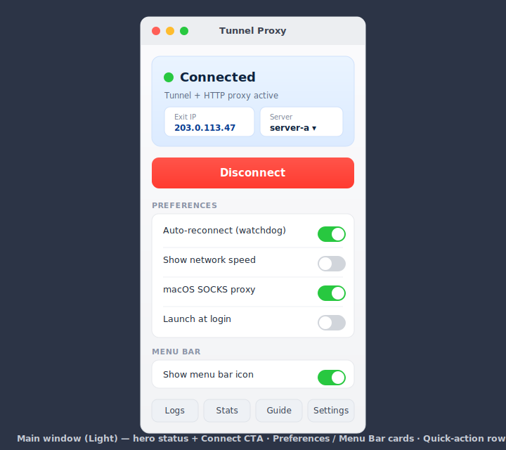
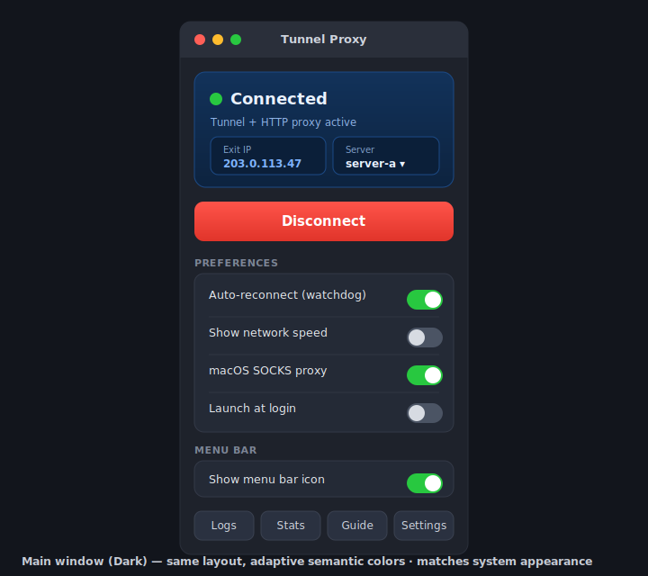
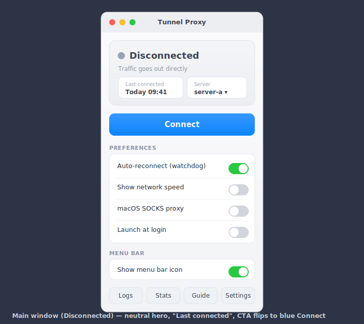
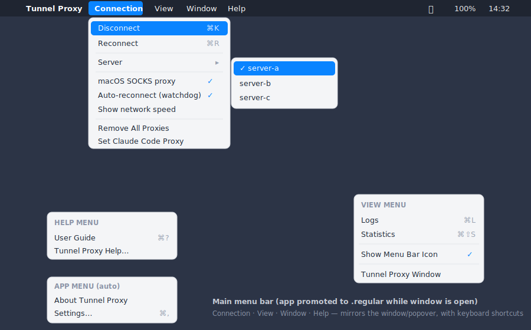

# Plan: Redesign the main window UI + add a real menu bar

## Context

The [main window](../TunnelProxy/Views/MainWindowView.swift) shipped as a thin
`ScrollView` wrapper around `TunnelControlsView` — the same compact stack the
menu-bar popover uses, just stretched to window width. It reads as a blown-up
popover rather than a real app window: no visual hierarchy, everything one flat
column of dividers, toggles floating without grouping, and no sense of "primary
action vs. settings." It looks unfinished.

Two things to fix:

1. **Redesign the window** into a proper macOS window: a **hero status block**
   with the primary Connect/Disconnect action, the rest organized into **titled
   cards** (Preferences, Menu Bar) plus a **quick-action row**. Adaptive
   light/dark via SwiftUI semantic colors.
2. **Add a real menu bar.** When the window opens the app promotes to `.regular`
   (Dock icon appears) but currently shows only AppKit's default auto-generated
   menus. A normal app should present its own menus on the left of the system
   menu bar — **Connection · View · Window · Help** — mirroring the window's
   actions with keyboard shortcuts. **Guide and Settings move into the menus**
   (Settings → app menu, User Guide → Help), so the window's quick-action row can
   shed them.

The **menu-bar popover stays exactly as-is** — the redesign is window + menus only.

## Mockups

### Main window — connected (light)



### Main window — connected (dark, adaptive proof)



### Main window — disconnected



### Main menu bar (app menus on the left of the system bar)



## Window layout (top → bottom)

1. **Hero card** — rounded, tinted (blue when connected, neutral when not).
   - Large status dot + `state.label` ("Connected" / "Disconnected" / …), subtitle underneath.
   - Two stacked info **chips**: Exit IP (or "Last connected" when down) and the **Server picker**.
2. **Primary CTA** — full-width, tall button. Blue **Connect** / red **Disconnect**; disabled + dimmed when busy / unconfigured / privoxy missing. A small `ProgressView` overlay while busy.
3. **PREFERENCES card** — grouped switch rows with hairline separators: Auto-reconnect (watchdog), Show network speed, macOS SOCKS proxy, Launch at login.
4. **MENU BAR card** — single row: Show menu bar icon.
5. **Quick-action row** — Logs · Statistics (Guide and Settings now live in the menus).

Warnings (no server / not configured / privoxy missing) render as an inline
banner directly under the CTA, same conditions as today.

## Menu bar structure

Built with SwiftUI `.commands { }` on the `WindowGroup`/`Window` scene, so the
menus appear whenever the app is `.regular` (window open). All items call the
**existing** `TunnelController` methods; toggles show a checkmark bound to state.

- **Tunnel Proxy** (app menu — mostly auto)
  - About Tunnel Proxy *(auto)*
  - Settings… — `⌘,` *(auto, via the `Settings` scene)*
  - Quit Tunnel Proxy — `⌘Q` *(auto; disconnects via `applicationWillTerminate` path)*
- **Connection** *(new — `CommandMenu`)*
  - **Connect** `⌘K` / **Disconnect** `⌘K` — label + action flip on `isConnected`; disabled when busy/unconfigured
  - **Reconnect** `⌘R` — disconnect then connect
  - Server ▸ — submenu of `config.servers`, checkmark on the selected, action `selectServer(_:)`
  - macOS SOCKS proxy — checkmark toggle → `toggleSystemSocks(on:)`
  - Auto-reconnect (watchdog) — checkmark toggle → `watchdogEnabled`
  - Show network speed — checkmark toggle → `showSpeed`
  - Remove All Proxies — `removeAllProxies()`
  - Set Claude Code Proxy — existing Tools action
- **View** *(new — `CommandMenu`)*
  - Logs `⌘L` — `openWindow(id: "logs")`
  - Statistics `⌘⇧S` — `openWindow(id: "statistics")`
  - Show Menu Bar Icon — checkmark toggle → `showMenuBarIcon`
  - Tunnel Proxy Window — `openWindow(id: "main")` (re-front the main window)
- **Window** *(auto — standard SwiftUI)*
- **Help** *(replace default — `CommandGroup(replacing: .help)`)*
  - User Guide `⌘?` — `openWindow(id: "user-guide")` (only if `AppPaths.userGuide != nil`)

## Implementation

The redesign is confined to the view/scene layer. The shared `TunnelControlsView`
keeps driving the **popover** unchanged; the **window** gets its own styled view,
and menus come from `.commands`.

### 1. New window layout — [Views/MainWindowView.swift](../TunnelProxy/Views/MainWindowView.swift)

Replace the body with the hero + cards layout, keeping the existing lifecycle
hooks untouched (`controller.onAppear()`, `AppDelegate.openMainWindow`
registration, and the `AppActivation.becomeRegular()` — currently dispatched
async — on appear / `becomeAccessory()` on disappear). Wrap in a `ScrollView` so
it works at min height.

Decompose into subviews (`HeroCard`, `PrimaryActionButton`, `PreferencesCard`,
`MenuBarCard`, `QuickActionsRow`), each reading `@EnvironmentObject controller`
and calling existing methods — no controller changes:
- Connect/Disconnect → `controller.connect()` / `disconnect()` (mirror `primaryAction` in [TunnelControlsView.swift](../TunnelProxy/Views/TunnelControlsView.swift)).
- Server pick → `selectServer(_:)` (reuse the `serverPicker` `Binding`).
- SOCKS toggle → the guarded intent `Binding` calling `toggleSystemSocks(on:)`.
- Other toggles bind to `watchdogEnabled` / `showSpeed` / `launchAtLogin` / `showMenuBarIcon`.
- Logs/Stats → `openWindow(id:)` + `activateApp()` raise.

### 2. Menu commands — [TunnelProxyApp.swift](../TunnelProxy/TunnelProxyApp.swift)

Attach `.commands { … }` to the `Window("Tunnel Proxy", id: "main")` scene:
- `CommandGroup(replacing: .help) { … }` for User Guide.
- `CommandMenu("Connection") { … }` and `CommandMenu("View") { … }` for the rest.
- Use `Button(…) { … }.keyboardShortcut(…)` and, for toggles, a `Toggle` /
  `Button` with a leading checkmark image driven by state.

Commands run **outside** the view tree, so they can't use `@EnvironmentObject`.
Give them the controller by referencing the App's `@StateObject controller`
directly (the App owns it), and use the App-level `@Environment(\.openWindow)` /
`@Environment(\.openSettings)` for window/settings actions. Extract a
`TunnelCommands: Commands` struct that takes `controller` to keep the App body
readable.

Note: menu items must reflect live state (enabled/disabled, connect vs.
disconnect, checkmarks). Since `controller` is `@ObservableObject` and the App
observes it via `@StateObject`, the `.commands` rebuild when published state
changes.

### 3. Reusable style pieces (adaptive colors)

Small view helpers shared by the cards, using **semantic** colors:
- **Card** — `RoundedRectangle` filled with `Color(nsColor: .controlBackgroundColor)` (or `.background(.regularMaterial)`), hairline `.overlay` border via `Color(nsColor: .separatorColor)`, radius ~10.
- **Section caption** — uppercased `.caption2`, `.secondary`, letter-spaced.
- **Switch row** — reuse the existing `switchRow` shape inside the card with `Divider()` between rows.
- **Info chip** — `.caption2` label stacked over `.footnote` semibold value (monospaced IP).
- **Status accent** — reuse `statusColor`/`subtitle` from `TunnelControlsView`; hero tint = accent-blue when `.connected`, neutral `Color(nsColor: .windowBackgroundColor)` otherwise.

Lift the small shared bits (`statusColor`, `subtitle`, `isConnected`,
`activateApp`) into one helper so popover and window share a single copy.

### 4. Window sizing — [TunnelProxyApp.swift](../TunnelProxy/TunnelProxyApp.swift)

Tighten the default toward the mockup proportions (~340×620) and set
`.windowResizability(.contentSize)`. Update `MainWindowView`'s `.frame`
min/ideal accordingly (min width ~320, min height ~560).

### 5. Leave the popover alone

`TunnelControlsView` and [MenuBarView.swift](../TunnelProxy/Views/MenuBarView.swift)
render identically. If step 3 lifts helpers out, update references only.

## Files

- [TunnelProxy/Views/MainWindowView.swift](../TunnelProxy/Views/MainWindowView.swift) — new hero + cards layout, subviews, style helpers.
- [TunnelProxy/TunnelProxyApp.swift](../TunnelProxy/TunnelProxyApp.swift) — `.commands` menus (`TunnelCommands`), window default size / resizability.
- [TunnelProxy/Views/TunnelControlsView.swift](../TunnelProxy/Views/TunnelControlsView.swift) — only if shared helpers are lifted (behavior-preserving).
- No `TunnelController` changes — all actions/state already exist.

## Verification

```bash
xcodebuild -project TunnelProxy.xcodeproj -scheme TunnelProxy -configuration Debug build
open ~/Library/Developer/Xcode/DerivedData/TunnelProxy-*/Build/Products/Debug/TunnelProxy.app
```
1. Window opens showing hero + Preferences/Menu Bar cards + quick-action row; screenshot and compare to the light mockup.
2. Menu bar shows **Tunnel Proxy · Connection · View · Window · Help**; each menu matches the menu-bar mockup. Shortcuts work (`⌘K`, `⌘R`, `⌘L`, `⌘⇧S`, `⌘?`, `⌘,`).
3. Menu items reflect live state: Connect↔Disconnect flips, checkmarks track toggles, items disable when busy/unconfigured, Server submenu marks the active one.
4. Toggle system appearance (`defaults write -g AppleInterfaceStyle Dark`) → window restyles to the dark mockup; no hard-coded colors leak.
5. Every control (window + menus) drives the shared `TunnelController` — changes reflect live in the menu-bar popover.
6. Menus disappear when the window closes (app back to `.accessory`); the popover is visually unchanged.
