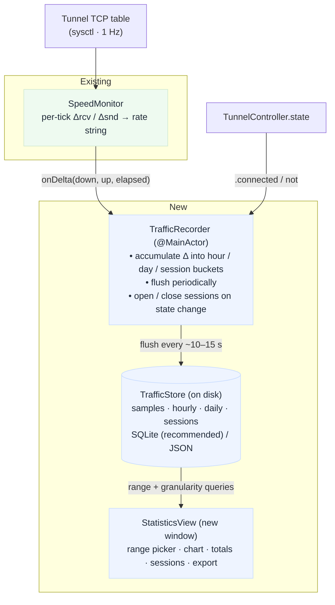
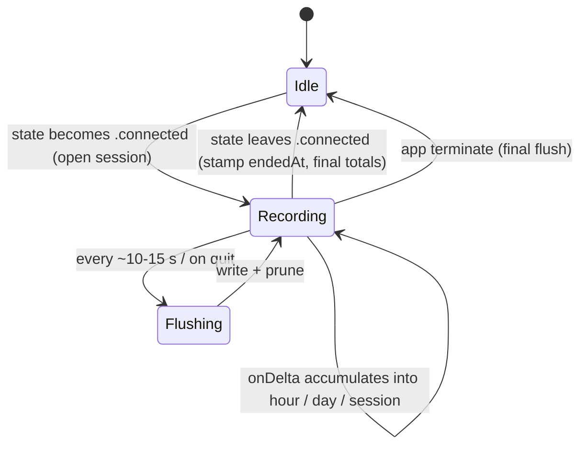
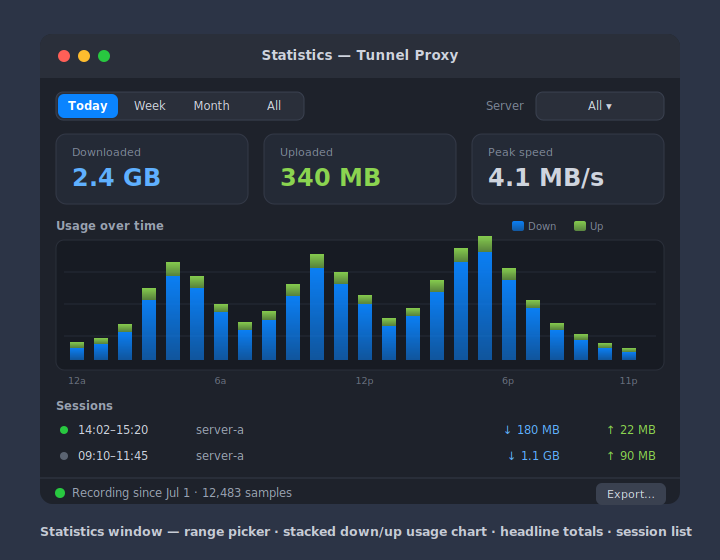

# Plan: Network Traffic Recording & Statistics

Add persistent **traffic recording** and a **statistics** view to the macOS app.
The app already measures the tunnel's live throughput (see
[SpeedMonitor.swift](../TunnelProxy/Controllers/SpeedMonitor.swift)); this
feature turns those transient per-second readings into a durable time-series and
surfaces usage totals and charts in a dedicated window.

## Decisions (confirmed)

| Question | Choice |
|----------|--------|
| Recording depth | **Volume history** — total bytes up/down over time. No per-domain / per-request data, no packet capture, no new privileges. |
| Stats UI | **New Statistics window** (like the Logs window), with time-range picker, charts, and totals. |
| Data source | Reuse `SpeedMonitor`'s TCP sequence-number sampling — the tunnel's own on-wire bytes. |

Rationale: volume history is derivable from the sampling the app *already* does
(~2 ms sysctl, no subprocess, no privileges). Per-domain/request would require
turning on and parsing Privoxy access logs; full packet capture would require a
BPF/Network-Extension path with root. Neither is justified for a usage-stats
feature — this plan is intentionally scoped to bytes-over-time. Per-domain is
noted as a future extension.

## Goals

- **Record** cumulative down/up bytes for the tunnel continuously while connected,
  persisted across app launches.
- **Aggregate** into rollups: per-hour and per-day totals, plus per-connection
  "session" totals.
- **Show statistics** in a new window: time-range picker (Today / Week / Month /
  All), a usage-over-time chart, headline totals, and a session list.
- **Survive** app quit/relaunch, tunnel reconnects, SOCKS-port changes, and clock
  changes without producing spikes or double-counting.
- **Bounded storage** — old fine-grained samples are pruned; long-term history is
  kept only as coarse daily rollups.

## Non-goals

- Per-domain / per-request / per-app breakdown (needs Privoxy log parsing — future).
- Packet capture / DPI (needs elevated privileges).
- System-wide traffic accounting — we measure only the tunnel, matching today's
  SpeedMonitor semantics (compressed on-wire bytes when `ssh -C` is active).
- Direct (non-tunnelled) traffic while disconnected — nothing to attribute it to.
- Syncing / exporting to a server. (Local CSV/JSON export is a small optional add.)

## Architecture



The **key change to SpeedMonitor**: it currently *discards* each tick's byte
deltas after formatting them into a rate string. We add a lightweight callback so
those same deltas feed the recorder — no second sampling pass, no extra sysctl.

### Data model

`TrafficSample` — the raw feed (one row per sampling tick, ~1 Hz while connected):

```swift
struct TrafficSample {
    let at: Date          // tick end time
    let down: UInt64      // bytes received this tick
    let up: UInt64        // bytes sent this tick
    let serverID: UUID?   // active server at the time (nil if unknown)
}
```

Rollups derived from samples (what the UI mostly reads):

```swift
struct TrafficBucket {         // one per hour and one per day
    let start: Date            // bucket start (hour or day boundary, local tz)
    let granularity: Granularity  // .hour | .day
    let down: UInt64
    let up: UInt64
}

struct TrafficSession {        // one connected span
    let id: UUID
    let serverID: UUID?
    let startedAt: Date
    let endedAt: Date?         // nil while still connected
    let down: UInt64
    let up: UInt64
}
```

### Storage: SQLite (recommended) vs JSON

- **SQLite (via `SQLite3` C API or GRDB)** — recommended. Cheap incremental
  appends, indexed range queries for the charts, easy pruning with a single
  `DELETE`. A single file at
  `~/Library/Application Support/TunnelProxy/traffic.sqlite`.
- **JSON files** — matches the existing config/log style and adds no dependency,
  but rewriting a growing file on every flush is wasteful and range queries mean
  loading everything. Acceptable only if we keep *just* the coarse rollups in JSON
  and never persist raw samples.

Default to SQLite with the built-in `libsqlite3` (no third-party dependency, links
against the system library). If we want to avoid even that, fall back to
**append-only rollups in JSON** (hourly + daily arrays + sessions array), pruned
in place. Add a `traffic.sqlite`/`traffic.json` entry to
[AppPaths.swift](../TunnelProxy/Controllers/AppPaths.swift).

### Retention

- **Raw samples**: keep the last N hours (e.g. 48 h) only — enough to redraw a
  detailed recent chart; pruned on each flush.
- **Hourly buckets**: keep ~90 days.
- **Daily buckets**: keep indefinitely (tiny — ~365 rows/yr).
- **Sessions**: keep last ~1000, or last ~1 year.

All thresholds are constants in `TrafficStore`, documented inline.

## Recording pipeline (the careful part)

Session lifecycle is driven by connection state; byte deltas are only accumulated
while a session is open:



The correctness pitfalls mirror the ones SpeedMonitor already solves — reuse its
logic rather than re-deriving:

1. **Feed from existing deltas.** SpeedMonitor already computes per-tick `dRx` /
   `dTx` in [`tick()`](../TunnelProxy/Controllers/SpeedMonitor.swift). Add an
   `onDelta: ((down: UInt64, up: UInt64, elapsed: TimeInterval) -> Void)?` hook
   (or a Combine publisher) invoked once per tick with those values. The recorder
   subscribes.

2. **Reconnect / new-tuple safety.** SpeedMonitor deliberately contributes *zero*
   for connection 4-tuples not present in both consecutive samples, so a watchdog
   reconnect seeds a fresh baseline instead of spiking. Because the recorder
   consumes the *same* per-tick deltas, it inherits this correctness for free — do
   **not** re-read the TCP table independently.

3. **Only count while connected.** Gate recording on
   `TunnelController.state == .connected`. When disconnected, SpeedMonitor already
   emits zero; the recorder should also **close the current session**.

4. **Clock changes.** Bucket boundaries use wall-clock time. If the system clock
   jumps backward, guard against negative bucket math (clamp, don't crash). Prefer
   assigning a sample to a bucket by its own `at` timestamp rather than "now".

5. **Flush cadence.** Accumulate deltas in memory and flush to disk every ~10–15 s
   (and on disconnect / app termination / `applicationWillTerminate`) to bound I/O
   and avoid losing more than one flush interval of data on a crash.

6. **Sessions.** Open a `TrafficSession` when state → `.connected`; accumulate the
   session's running totals from the same deltas; stamp `endedAt` and final totals
   when state leaves `.connected` (disconnect, error, or quit).

### New components

- **`TrafficRecorder`** — `@MainActor ObservableObject`. Subscribes to
  SpeedMonitor's per-tick deltas, maintains the in-memory current-hour/day/session
  accumulators, flushes to `TrafficStore`, and prunes. Observes
  `TunnelController.state` to open/close sessions. Owned by `TunnelController`
  alongside `speedMonitor`.
- **`TrafficStore`** — persistence layer (SQLite or JSON). Pure data access:
  `append(samples:)`, `upsert(bucket:)`, `sessions(in:)`, `buckets(range:,granularity:)`,
  `prune()`, `totals(in:)`. No UI, no timers.
- **`StatisticsView`** — new SwiftUI window (registered in
  [TunnelProxyApp.swift](../TunnelProxy/TunnelProxyApp.swift) as a
  `Window("Statistics", id: "statistics")`, opened from the popover like Logs).

## Statistics window (UI)

Follows the Logs window pattern (toolbar + body + status bar). Uses Swift
**Charts** (`import Charts`, available macOS 13+).



*Design mockup: [mockups/statistics.svg](mockups/statistics.svg) — toolbar
(range segmented control + server picker), headline totals, stacked down/up usage
chart, session list, and a status bar with export.*

- **Range picker** drives which granularity is queried: Today → hourly buckets;
  Week/Month → daily buckets; All → daily buckets.
- **Chart** stacks download vs upload. Reuse `SpeedMonitor.format(bytesPerSec:)`
  and add a companion `formatBytes(_:)` for cumulative totals (KB/MB/GB).
- **Server filter** (optional) narrows to one profile using the stored `serverID`.
- **Export** (optional) writes the current range as CSV/JSON to a save panel.

### Popover integration

- Add a **"Statistics…"** button in
  [MenuBarView.swift](../TunnelProxy/Views/MenuBarView.swift)'s `menuItems`,
  next to "View Logs…", opening the `statistics` window.
- No inline totals in the popover (per the chosen design) — keep the popover lean.

## Settings / privacy

- Add a **"Record traffic statistics"** toggle (default **on**) in
  [SettingsView.swift](../TunnelProxy/Views/SettingsView.swift), persisted in
  `UserDefaults` like the other prefs on `TunnelController`. When off,
  `TrafficRecorder` stops writing.
- Add **"Clear statistics…"** (with confirmation) that empties `TrafficStore`.
- Note in the User Guide that stats are **local-only** and record byte *volume*,
  not sites visited.

## Files touched / added

| File | Change |
|------|--------|
| `Controllers/SpeedMonitor.swift` | Emit per-tick `(down, up, elapsed)` deltas via a callback/publisher. |
| `Controllers/TrafficRecorder.swift` | **New** — accumulate, session lifecycle, flush, prune. |
| `Controllers/TrafficStore.swift` | **New** — SQLite/JSON persistence + queries. |
| `Controllers/AppPaths.swift` | Add `trafficStoreURL`. |
| `Controllers/TunnelController.swift` | Own `TrafficRecorder`; add `recordStats` pref; wire session open/close to `state`. |
| `Views/StatisticsView.swift` | **New** — window UI with chart, totals, sessions. |
| `Views/MenuBarView.swift` | Add "Statistics…" menu item. |
| `Views/SettingsView.swift` | Add record toggle + clear button. |
| `TunnelProxyApp.swift` | Register the `statistics` `Window`. |
| `en.lproj` / `zh-Hans.lproj` `Localizable.strings` | New strings. |

## Milestones

1. **Recording core** — SpeedMonitor delta hook + `TrafficRecorder` +
   `TrafficStore` (samples → hourly/daily rollups + sessions), flush & prune. No
   UI yet; verify by inspecting the store file while connected.
2. **Statistics window** — `StatisticsView` with range picker, chart, headline
   totals; register window + popover button.
3. **Sessions & server filter** — session list, per-server filtering.
4. **Settings & privacy** — record toggle, clear button, guide note, localization.
5. **Polish** — export, retention tuning, empty/edge states (no data, clock jump,
   very long sessions).

## Verification

- **Correctness:** connect, run a known transfer (e.g. `curl` a fixed-size file
  through the proxy), confirm the recorded total is within a few % of the actual
  size (compression via `-C` means recorded on-wire bytes ≤ payload — document
  this).
- **Reconnect:** kill the ssh process mid-transfer; confirm the watchdog reconnect
  produces **no spike** and the session total stays monotonic.
- **Restart:** quit and relaunch; confirm history persists and a new session opens.
- **Clock jump:** set the clock back an hour; confirm no crash and no negative
  buckets.
- **Retention:** simulate old data; confirm pruning keeps the store bounded.

## Future extensions (out of scope now)

- Per-domain / per-request breakdown via Privoxy access-log parsing (`debug 1024`
  request logging → parse into a `host`-keyed table).
- Menu-bar inline daily total.
- Data usage alerts / caps (notify at N GB/day).
- iCloud/file export sync.
