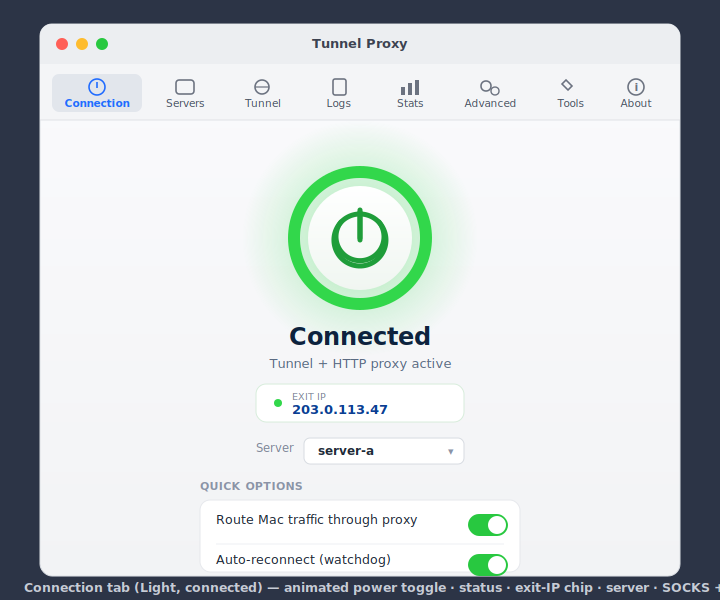
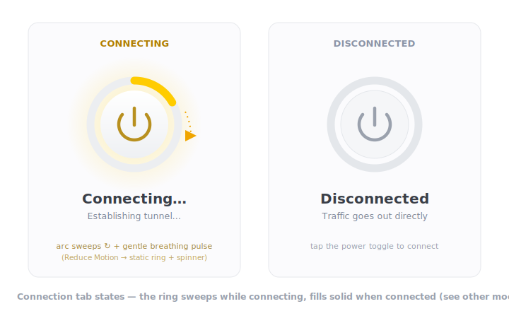
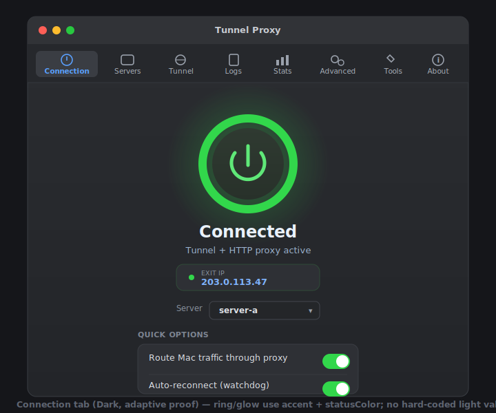
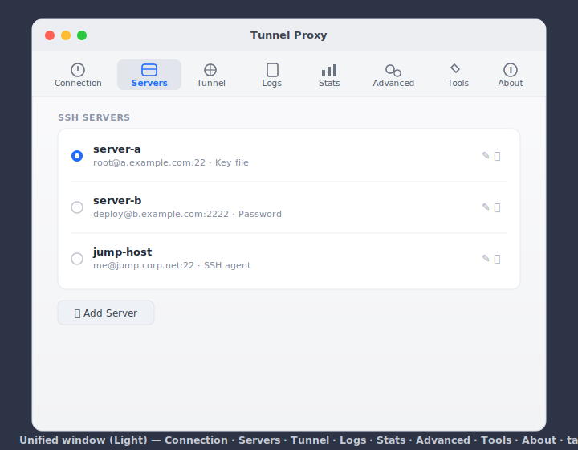
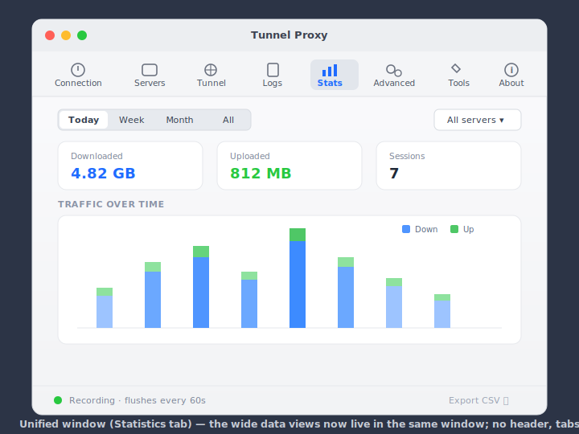
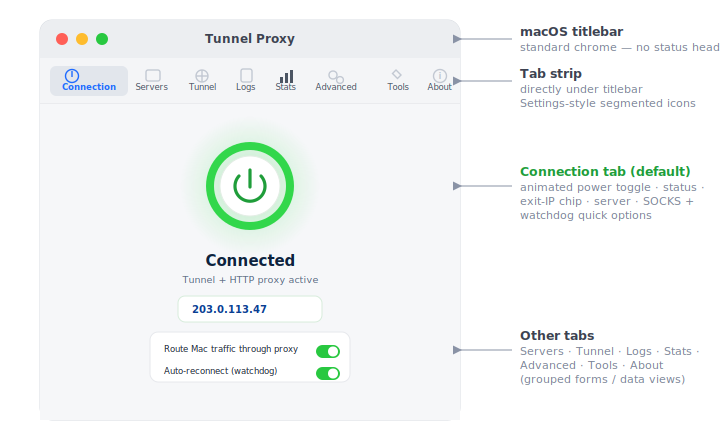
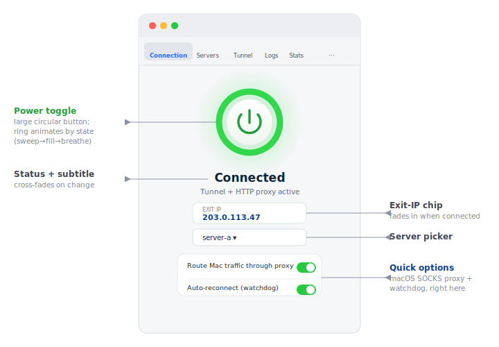

# Plan: Merge the main window + settings into one unified tabbed window

> **Status: implemented.** This document reflects the as-built design. Where the
> build diverged from the original proposal, the divergence is noted inline.

## Context

The app previously opened **several independent windows**, each its own top-level
SwiftUI scene:

- **Main window** (`Window id: "main"`) — hero status + Connect/Disconnect +
  preference toggles (`MainWindowView.swift`, now deleted).
- **Settings** (`Settings` scene, ⌘,) — a `TabView` of **Servers · Tunnel ·
  Advanced · Tools · About** ([SettingsView.swift](../TunnelProxy/Views/SettingsView.swift)).
- **Logs** (`Window id: "logs"`) — [LogsView.swift](../TunnelProxy/Views/LogsView.swift).
- **Statistics** (`Window id: "statistics"`) — [StatisticsView.swift](../TunnelProxy/Views/StatisticsView.swift).
- **User Guide** (`Window id: "user-guide"`) — [ManualView.swift](../TunnelProxy/Views/ManualView.swift).

The two the user hit most — the **main window** and **Settings** — were separate,
so connecting and configuring meant juggling windows.

**Goal (achieved):** collapse the main window **and** Settings **and** Logs **and**
Statistics into **one** window. Connection lives in its own first-class
**Connection** tab built around a large animated power toggle; the config/data
tabs follow. There is **no persistent header**. The window chrome mirrors the
macOS **Calendar** app: a hidden titlebar with the icon tabs living in the top
band, so the top reads as one continuous surface. The menu-bar **popover stays
exactly as-is** (it remains the fast one-click surface).

The UX decisions below are confirmed with the user:

| Decision | Choice |
|----------|--------|
| Where does Connect/Disconnect + status live? | Its own **Connection** tab (first tab) — **no persistent header** |
| Primary control style | **Big circular power toggle** with state-driven ring animation |
| macOS SOCKS proxy toggle | Lives **in the Connection tab** (Quick Options), not buried in settings |
| Logs & Statistics | **Folded in as tabs** — one window for everything |
| About tab | **Removed** — app identity stays in the standard "About Tunnel Proxy" app-menu item |
| Tab chrome | **Calendar-style hidden titlebar**: vertical icon+label tabs in a gray top band, white content below |

## Mockups

> The SVG mockups predate the final Calendar-style chrome (they show a standard
> tab strip under a normal titlebar). The *content* of each tab — power toggle,
> Quick Options, grouped forms, stats — matches the build; only the window
> top-band styling evolved (see [Window chrome](#window-chrome-calendar-style)).

### Connection tab — connected (light)



### Connection tab — connecting (animation) + disconnected



### Connection tab — connected (dark, adaptive proof)



### Servers tab (Settings-style grouped form)



### Statistics tab (wide data view living in the same window)



## Target window layout (top → bottom)



1. **Top band (tab strip)** — a gray band spanning the full width, occupying what
   would be the titlebar plus a tab row. The window's titlebar is **hidden**
   (`.windowStyle(.hiddenTitleBar)`); the traffic-light buttons float over the
   band's top-left. The tabs are **vertical icon-above-label** buttons, centered,
   with the selected one in an accent pill. Order:
   - **Connection** *(default)* — animated power toggle + live status + quick options.
   - **Servers** — `ServersView`.
   - **Tunnel** — ports, network service, watchdog, runtime deps.
   - **Logs** — `LogsView`, embedded (was a standalone window).
   - **Statistics** — `StatisticsView`, embedded (was a standalone window).
   - **Advanced** — startup, statistics recording, files, menu-bar toggles.
   - **Tools** — Claude Code proxy, remove-all-proxies.
2. **Tab content** — the selected tab, on a **white** surface. The Connection tab
   is a centered vertical stack; the config tabs are `.formStyle(.grouped)` forms;
   Logs/Stats are their existing wide data views.

## Window chrome (Calendar-style)

The final chrome differs from the original "standard tabs under a normal
titlebar" proposal. Getting a seamless, single-color top proved impossible with a
normal titlebar (the macOS titlebar renders `#EDEEF0` while SwiftUI's
`.windowBackgroundColor` renders `#EAEBEC`, leaving a visible seam; and the
titlebar toolbar clips a tall vertical icon+label stack). The robust solution,
matching macOS Calendar:

- **`.windowStyle(.hiddenTitleBar)`** on the `Window` scene — no title text, and
  content extends to the very top.
- The tab strip is the **top of the content `VStack`**, not a `.toolbar` item, so
  it can be as tall as the vertical icon+label buttons need (no titlebar
  clipping). `.padding(.top, 28)` clears the floating traffic-light buttons;
  `.ignoresSafeArea(.container, edges: .top)` lets the band reach the very top.
- The band is painted with `WindowStyle.titlebar` — an explicit adaptive gray
  (light `#ECECEC` / dark `#2A2A2C`) — so the whole top is **one uniform color**
  (verified by pixel-sampling: uniform `#ECECEC`, transitioning cleanly to white
  `#FFFFFF` at the content edge).
- Content sits on `Color(nsColor: .textBackgroundColor)` (white in light mode).

## The Connection tab



A vertical, centered layout — the visual counterweight to the dense config tabs
([ConnectionTab.swift](../TunnelProxy/Views/ConnectionTab.swift)):

1. **Power toggle** (centerpiece) — a large (~132 pt) circular button with a
   `power` SF Symbol in the middle and an animated ring around it. Tapping calls
   `controller.toggleConnection()`. State is read through color + motion:
   - **Disconnected** — thin grey ring, muted glyph.
   - **Connecting / Reconnecting** — an accent arc **sweeps** around the ring
     (indeterminate) + a soft breathing pulse; glyph dimmed.
   - **Connected** — full ring, radial glow behind the button, gentle breathing.
   - **Error** — colored ring; tapping retries.
   Disabled + dimmed (opacity 0.5) when `!canToggleConnection` (busy / unconfigured
   / privoxy missing).
2. **Status label + subtitle** — `state.label` (24 pt heavy) + `stateSubtitle`,
   cross-fading on state change.
3. **Exit-IP chip** — when connected: a pill with a status dot, `EXIT IP` caption,
   and the monospaced address, transitioning in with fade + rise. When down, shows
   a "Last connected …" chip if a timestamp exists.
4. **Server picker** — inline `Picker` (existing binding), disabled while busy or
   connected; shows "None — add one in Servers" when empty.
5. **Quick Options** — a `SectionCard` with:
   - **Route Mac traffic through proxy** — the guarded intent binding calling
     `toggleSystemSocks(on:)` (no `networksetup` re-issue on a no-op change).
   - **Auto-reconnect (watchdog)** — `watchdogEnabled`.
6. **Inline warning** — no server / not configured / privoxy missing renders as a
   `WarningBanner` under the status label.

### Animation & states

Purely SwiftUI, no controller timers (state already publishes) — in
`PowerToggle`:

- **Ring sweep (connecting):** a trimmed `Circle().trim(from: 0, to: 0.3)` stroke
  with `.rotationEffect` animated by `.linear(duration: 1).repeatForever`, driven
  by an `animating` `@State` synced in `.onAppear` / `.onChange(of: state)`.
- **Breathing (connected):** `scaleEffect` ~1.0↔1.03 via
  `.easeInOut(duration: 2).repeatForever(autoreverses: true)`.
- **State transitions:** ring color/glyph/glow + status text animate with
  `.easeInOut(duration: 0.35)` keyed on `controller.state`.
- **Exit-IP chip:** `.transition(.opacity.combined(with: .move(edge: .bottom)))`.
- **Reduce Motion:** the repeating animations are gated on
  `@Environment(\.accessibilityReduceMotion)` — a static partial ring replaces the
  sweep/breathing.

## Toggle inventory — nothing got lost in the merge

The old main window's controls all landed somewhere:

| Old main-window control | New home |
|-------------------------|----------|
| Connect / Disconnect + status + exit IP + server picker | **Connection tab** (power toggle + status + chip + picker) |
| macOS SOCKS proxy | **Connection tab** → Quick Options (guarded intent binding) |
| Auto-reconnect (watchdog) | **Connection tab** → Quick Options **and** the **Tunnel** tab next to *Watchdog Interval* |
| Show network speed | **Advanced** tab → "Menu Bar" section |
| Launch at login | **Advanced** tab → Startup |
| Show menu bar icon | **Advanced** tab → "Menu Bar" section |
| Logs / Statistics buttons | Now first-class **tabs** |

Advanced's **"Menu Bar"** section holds *Show menu bar icon* + *Show network
speed*. SOCKS + watchdog live front-and-center in the Connection tab.

## Scene / window changes

In [TunnelProxyApp.swift](../TunnelProxy/TunnelProxyApp.swift):

- **Kept** the `MenuBarExtra` scene (popover) unchanged.
- **One** `Window("Tunnel Proxy", id: "main")` hosting `UnifiedWindowView`, with
  `.defaultSize(width: 720, height: 620)`, `.windowResizability(.contentMinSize)`,
  and **`.windowStyle(.hiddenTitleBar)`**.
- **Removed** the standalone `Window(id: "logs")` and `Window(id: "statistics")`
  scenes — their views are now tabs. Popover buttons and the `TunnelCommands`
  View-menu items select the corresponding tab and raise the main window (see
  [Tab selection](#tab-selection-from-popover--menus)).
- **`Settings` scene** is **thin**: its body sets `requestedTab = .servers`, opens
  the main window, and activates — so ⌘, lands on the config surface without a
  second window ([SettingsView.swift](../TunnelProxy/Views/SettingsView.swift)).
- **Kept** `Window(id: "user-guide")` — the manual is a separate reference window.

Net scenes: `MenuBarExtra`, `Window("main")`, `Settings` (thin), `Window("user-guide")`.

## Implementation (as built)

### 1. `UnifiedWindowView` — [Views/UnifiedWindowView.swift](../TunnelProxy/Views/UnifiedWindowView.swift)

A `VStack` (**not** a `TabView` — the `TabView` chrome couldn't produce the
Calendar look):

```
VStack(spacing: 0) {
    TabToolbar(selection: $tab)         // vertical icon+label buttons
        .padding(.top, 28).padding(.bottom, 6)
        .frame(maxWidth: .infinity)
        .background(WindowStyle.titlebar)   // uniform gray top band
    content                              // @ViewBuilder switch over `tab`
        .frame(maxWidth: .infinity, maxHeight: .infinity)
        .background(Color(nsColor: .textBackgroundColor))   // white
}
.frame(minWidth: 680, idealWidth: 720, minHeight: 560, idealHeight: 620)
.ignoresSafeArea(.container, edges: .top)
.onChange(of: controller.requestedTab) { … route to tab … }
.onAppear { controller.onAppear(); AppDelegate.openMainWindow = …; AppActivation.becomeRegular() }
.onDisappear { AppActivation.becomeAccessory() }
```

- `content` is a `@ViewBuilder switch tab { … }` that mounts one tab view at a
  time (so `LogsView`'s tailer / `StatisticsView`'s recorder reload only run for
  the visible tab).
- `TabToolbar` + `TabButton` are private subviews: a centered `HStack` of vertical
  icon-above-label buttons (16 pt icon, 11 pt label), accent color + a rounded
  `Color.secondary.opacity(0.20)` pill on the selected tab, hover feedback.
- `@SceneStorage("mainTab")` persists the selected tab (defaults to `.connection`).
- `WindowStyle.titlebar` is the adaptive top-band gray; `AppActivation` flips the
  activation policy; the shared style helpers `SectionCard` / `SwitchRow` /
  `ChipContainer` / `WarningBanner` live here too (migrated from the deleted
  `MainWindowView.swift`).

```
enum WindowTab: String { case connection, servers, tunnel, logs, stats, advanced, tools }
```

### 2. `ConnectionTab` — [Views/ConnectionTab.swift](../TunnelProxy/Views/ConnectionTab.swift)

The animated `PowerToggle` + status + exit-IP chip (`ChipContainer`) + server
picker + a `QuickOptionsCard` (`SectionCard` with the SOCKS + watchdog
`SwitchRow`s). Everything binds to existing `TunnelController` state/actions
(`statusColor`, `stateSubtitle`, `isConnected`, `canToggleConnection`,
`toggleConnection`, the guarded SOCKS binding, `watchdogEnabled`) — **no new
controller state** beyond `requestedTab`.

### 3. Settings tabs extracted — [Views/SettingsView.swift](../TunnelProxy/Views/SettingsView.swift)

The former inner tab bodies are now standalone structs — `TunnelTab`,
`AdvancedTab`, `ToolsTab` — reused by the unified window. `SettingsView` is the
thin ⌘,-router. Each tab owns its `@State` + `.onAppear` refreshers. Every grouped
form uses `.formStyle(.grouped).scrollContentBackground(.hidden)` on a white
background so the content area matches the other tabs; cards/chips use the gray
`windowBackgroundColor` so they stand out on white. Changes vs. the old Settings:

- **About tab removed** (`AboutTab` deleted).
- **Advanced** gained a **"Menu Bar"** section (Show menu bar icon / Show network speed).
- **Tunnel** gained the *Auto-reconnect (watchdog)* toggle next to Watchdog Interval.

### 4. Tab selection from popover + menus

`@Published var requestedTab: WindowTab?` on `TunnelController` (the only
controller change). Setters open the main window + activate; `UnifiedWindowView`
observes it and switches `tab`.

- Popover ([TunnelControlsView.swift](../TunnelProxy/Views/TunnelControlsView.swift)):
  "View Logs…" → `.logs`; "Statistics…" → `.stats`; "Settings…" → `.servers`, via
  an `openMain(tab:)` helper.
- Menus ([TunnelProxyApp.swift](../TunnelProxy/TunnelProxyApp.swift) `TunnelCommands`):
  View-menu "Logs" (⌘L) → `.logs`; "Statistics" (⌘⇧S) → `.stats`; "Tunnel Proxy
  Window" → `.connection`. User Guide (⌘?) unchanged.

### 5. Deleted / retired

- **Deleted** `MainWindowView.swift` (hero/CTA became the Connection tab; helpers
  migrated to `UnifiedWindowView.swift`).
- **Kept** `TunnelControlsView.swift` + `MenuBarView.swift` (popover unchanged).
- Removed the standalone logs/statistics `Window` scenes.

## Files

- [TunnelProxy/Views/UnifiedWindowView.swift](../TunnelProxy/Views/UnifiedWindowView.swift) — **new**: top-band tab strip (`TabToolbar`/`TabButton`), `content` switch, lifecycle, `WindowTab`, `WindowStyle`, `AppActivation`, shared style helpers.
- [TunnelProxy/Views/ConnectionTab.swift](../TunnelProxy/Views/ConnectionTab.swift) — **new**: animated `PowerToggle` + status + exit-IP chip + server picker + Quick Options (SOCKS, watchdog).
- [TunnelProxy/Views/SettingsView.swift](../TunnelProxy/Views/SettingsView.swift) — `TunnelTab`/`AdvancedTab`/`ToolsTab` structs; Menu Bar section + watchdog toggle; grouped forms on white; About removed; `SettingsView` thin.
- [TunnelProxy/Views/LogsView.swift](../TunnelProxy/Views/LogsView.swift) / [StatisticsView.swift](../TunnelProxy/Views/StatisticsView.swift) / [ServersView.swift](../TunnelProxy/Views/ServersView.swift) — white content background; cards/chips on gray so they stand out.
- `TunnelProxy/Views/MainWindowView.swift` — **deleted**.
- [TunnelProxy/TunnelProxyApp.swift](../TunnelProxy/TunnelProxyApp.swift) — one hidden-titlebar `Window("main")`; removed logs/stats scenes; thin `Settings`; `.commands` remap Logs/Stats to tab-select; window sizing.
- [TunnelProxy/Controllers/TunnelController.swift](../TunnelProxy/Controllers/TunnelController.swift) — `WindowTab` enum + `@Published var requestedTab: WindowTab?`.
- Xcode project — added `UnifiedWindowView.swift` + `ConnectionTab.swift`, dropped `MainWindowView.swift`.

## Verification

```bash
xcodebuild -project TunnelProxy.xcodeproj -scheme TunnelProxy -configuration Debug build
open ~/Library/Developer/Xcode/DerivedData/TunnelProxy-*/Build/Products/Debug/TunnelProxy.app
```

1. Window opens on the **Connection** tab: big power toggle centered, status +
   subtitle below. Top band shows vertical icon+label tabs **Connection · Servers
   · Tunnel · Logs · Statistics · Advanced · Tools** (no About), nothing clipped.
2. **Chrome:** the top band is one uniform gray (titlebar area + tab strip, no
   seam, no divider), transitioning cleanly to a white content area. Traffic-light
   buttons float over the band's top-left.
3. **Animation:** disconnected → tap → ring sweeps + "Establishing tunnel…"; on
   success → ring fills, glow, gentle breathing, exit-IP chip fades in. Disconnect
   reverses. Reduce Motion → static ring, no sweep/breathing.
4. **SOCKS in Connection tab:** "Route Mac traffic through proxy" applies/clears
   the macOS SOCKS proxy (guarded — no `networksetup` re-issue on a no-op);
   watchdog toggle mirrors the Tunnel tab.
5. Every old main-window control is reachable — walk the
   [Toggle inventory](#toggle-inventory--nothing-got-lost-in-the-merge).
6. Logs tab streams live; Statistics tab renders the chart and reloads on recorder
   flush.
7. ⌘, opens/raises the window on the Servers tab; popover "Logs"/"Statistics"/
   "Settings" and the View menu (⌘L, ⌘⇧S) open the window on the right tab.
8. Dark mode (`defaults write -g AppleInterfaceStyle Dark`) → top band + content +
   cards restyle; ring/glow use `Color.accentColor` / `statusColor`.
9. The **menu-bar popover is visually unchanged**; closing the window drops the app
   back to `.accessory`, and closing never quits.
10. No orphaned scenes: `openWindow(id:"logs")` / `id:"statistics")` are gone from
    the codebase (grep), and the User Guide window still opens on its own.
```
